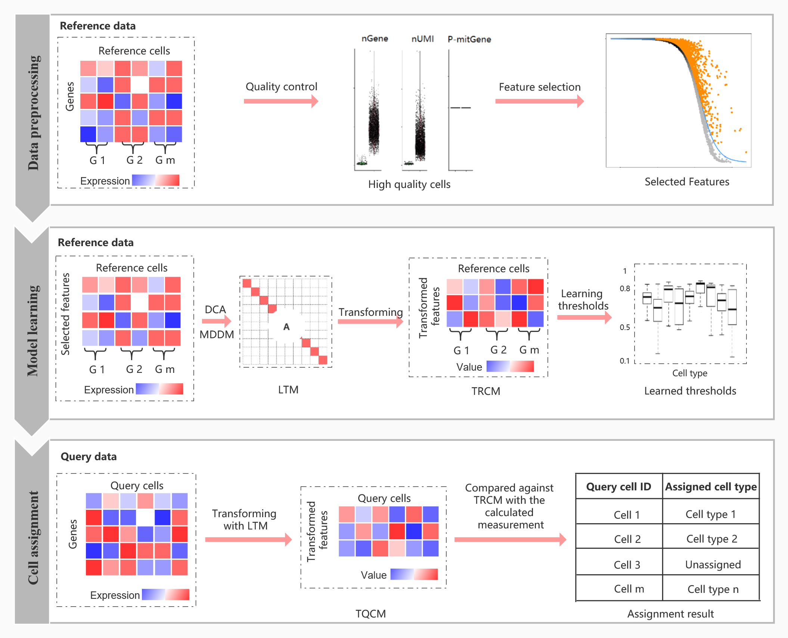
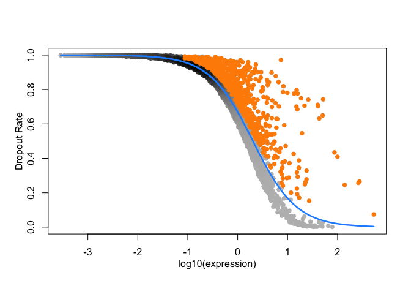

<!-- README.md is generated from README.Rmd. Please edit that file -->

# scLearn: A Unified Framework for Classification, Regression, and Model Interpretation

```{r, echo=FALSE, results="hide", message=FALSE}
Biocpkg <- function (pkg) {
    sprintf("[%s](http://bioconductor.org/packages/%s)", pkg, pkg)
}
library(conflicted)
conflicted::conflict_prefer("filter", "dplyr")
```

## Overview

scLearn is a learning-based framework designed to automatically infer quantitative measurements and similarity thresholds for single-cell assignment tasks. It achieves well-generalized performance across different single-cell types and is particularly robust in identifying novel cell types not present in reference datasets. scLearn introduces a multi-label single-cell assignment strategy for the first time, allowing simultaneous assignment of cell type and developmental stage, which is highly effective for cell development and lineage analysis.

```{r, echo=FALSE, out.width="80%", out.width="80%", dpi=400, fig.align="center", fig.cap="The Overview of scLearn"}

```

## :sunny: Key Features

1. **Robustness and Generalization**: scLearn is designed to be robust across various single-cell assignment tasks, providing consistent performance regardless of the cell type or dataset used.

2. **Efficiency in Novel Cell Type Identification**: scLearn efficiently identifies novel cell types that are absent in the reference datasets, overcoming limitations of traditional methods that rely on predefined similarity thresholds.

3. **Multi-Label Assignment**: scLearn proposes a multi-label assignment strategy, allowing simultaneous assignment of cell type and developmental stage. This dual assignment is particularly useful for understanding cell lineage and development.

4. **Pre-trained Models**: scLearn comes with pre-trained models and comprehensive reference datasets for human and mammalian single cells, facilitating broad applications in single-cell assignment.


## :arrow_double_down: Installation

### Release Version

```r
BiocManager::install("scLearn")
```

### Development Version

```r
# install.packages("devtools")
devtools::install_github("DuanLab1/scLearn", dependencies = c("Depends", "Imports", "LinkingTo"))
```

```{r, warning=FALSE, message=FALSE}
library(scLearn)
library(tidyverse)
library(SingleCellExperiment)
library(M3Drop)
```


## 🚀 Quick Start

### Single-label single cell assignment

#### Data preparation

+ `Reference Cell Database`: baron-human

+ `Query Cell Data`: Muraro-human

```{r}
data(RefCellData)
RefCellData

data(QueryCellData)
QueryCellData
```

#### cell quality control

```{r}
RefRawcounts <- assays(RefCellData)[[1]]
RefAnn <- as.character(RefCellData$cell_type1)
names(RefAnn) <- colnames(RefCellData)

RefDataQC <- Cell_qc(
  expression_profile = RefRawcounts, 
  sample_information_cellType = RefAnn, 
  sample_information_timePoint = NULL, 
  species = "Hs",
  gene_low = 500, 
  gene_high = 10000, 
  mito_high = 0.1, 
  umi_low = 1500, 
  umi_high = Inf, 
  logNormalize = TRUE, 
  plot = FALSE, 
  plot_path = "./quality_control.pdf")
```

#### rare cell type filtered

```{r}
RefDataQC_filtered <- Cell_type_filter(
  expression_profile = RefDataQC$expression_profile, 
  sample_information_cellType = RefDataQC$sample_information_cellType,
  sample_information_timePoint = NULL,
  min_cell_number = 10)
```

#### feature selection

```{r}
RefDataQC_HVG_names <- Feature_selection_M3Drop(
  expression_profile = RefDataQC_filtered$expression_profile,
  log_normalized = TRUE, 
  threshold = 0.05)
```

```{r, echo=FALSE, out.width="80%", out.width="80%", dpi=400, fig.align="center", fig.cap="feature selection"}

```

#### Model learning

Training the model. To improve the accuracy for "unassigned" cell, you can increase "bootstrap_times", but it will takes longer time. The default value of "bootstrap_times" is 10.

```{r}
scLearn_model_learning_result <- scLearn_model_learning(
  high_varGene_names = RefDataQC_HVG_names,
  expression_profile = RefDataQC_filtered$expression_profile,
  sample_information_cellType = RefDataQC_filtered$sample_information_cellType,
  sample_information_timePoint = NULL,
  bootstrap_times = 1,
  cutoff = 0.01,
  dim_para = 0.999
)
```

**Results**：`scLearn_model_learning_result`is the final result file containing the processed reference cell matrix.

-   `high_varGene_names`: The set of highly variable genes (`r length(scLearn_model_learning_result$high_varGene_names)` HVGs)

-   `simi_threshold_learned`: The similarity results between cell types

-   `trans_matrix_learned`: The transformed matrix (`r dim(scLearn_model_learning_result$trans_matrix_learned[[1]])[1]` features \* `r dim(scLearn_model_learning_result$trans_matrix_learned[[1]])[2]` HVGs)

-   `feature_matrix_learned`: After DCA, the matrix of cell type features (these features are obtained by dimensionality reduction of the highly variable gene set) (`r dim(scLearn_model_learning_result$feature_matrix_learned[[1]])[1]` celltype \* `r dim(scLearn_model_learning_result$feature_matrix_learned[[1]])[2]` features)


#### Cell assignment

Assignment with trained model above. To get a less strict result for "unassigned" cells, you can decrease "diff" and "vote_rate". If you are sure that the cell type of query cells must be in the reference dataset, you can set "threshold_use" as FALSE. It means you don't want to use the thresholds learned by scLearn.

```{r}
QueryRawcounts <- assays(QueryCellData)[[1]]
QueryDataQC <- Cell_qc(
  expression_profile = QueryRawcounts, 
  species = "Hs", 
  gene_low = 50, 
  umi_low = 50)

rownames(QueryDataQC$expression_profile) <- gsub("__\\w+\\d+", "", rownames(QueryDataQC$expression_profile))

scLearn_predict_result <- scLearn_cell_assignment(
  scLearn_model_learning_result = scLearn_model_learning_result, 
  expression_profile_query = QueryDataQC$expression_profile, 
  diff = 0.05, 
  threshold_use = TRUE, 
  vote_rate = 0.6)

head(scLearn_predict_result)
```

**Results**: The output consists of three columns of information. The `Query_cell_id` represents the cell ID, `Predict_cell_type` indicates the predicted cell type, and `Additional_information` provides the similarity results.

- Cells with a `Predict_cell_type` of *unassigned* are those that do not intersect with the reference cell set.


#### Accuracy

```{r}
QueryData_trueLabel <- as.character(QueryCellData$cell_type1)
names(QueryData_trueLabel) <- colnames(QueryCellData)

QueryData_CellType <- QueryData_trueLabel |> 
  as.data.frame() |>
  tibble::rownames_to_column("CellID") |>
  dplyr::rename(trueLabel = QueryData_trueLabel) |>  
  dplyr::inner_join(scLearn_predict_result |>
                      as.data.frame() |>
                      dplyr::rename(predLabel = Predict_cell_type),
                    by = c("CellID" = "Query_cell_id")) |>
  dplyr::select(CellID, trueLabel, predLabel, everything())

print(
  paste("Final Accuracy =", 
    sprintf("%1.2f%%",
      100 * sum(QueryData_CellType$predLabel == QueryData_CellType$trueLabel) / nrow(QueryData_CellType))))
```

### Multi-label single cell assignment

-   Data preprocessing

-   Model learning

-   Cell assignment: We just use `ESC.rds` itself to test the multi-label single cell assignment here.

Download [`ESC.rds`](https://www.jianguoyun.com/p/DeO3PrIQwdXjCBjq0cgD)

```r
# loading the reference dataset
RefData_MLab <- readRDS("ESC.rds")
RefRawcounts_MLab <- assays(RefData_MLab)[[1]]
RefAnn_MLab <- as.character(RefData_MLab$cell_type1)
names(RefAnn_MLab) <- colnames(RefData_MLab)
RefAnn2_MLab <- as.character(RefData_MLab$cell_type2)
names(RefAnn2_MLab) <- colnames(RefData_MLab)

# cell quality control and rare cell type filtered and feature selection
RefDataQC_MLab <- Cell_qc(
  expression_profile = RefRawcounts_MLab, 
  sample_information_cellType = RefAnn_MLab, 
  sample_information_timePoint = RefAnn2_MLab, 
  species = "Hs",
  gene_low = 500, 
  gene_high = 10000, 
  mito_high = 0.1, 
  umi_low = 1500, 
  umi_high = Inf, 
  logNormalize = TRUE, 
  plot = FALSE, 
  plot_path = "./quality_control.pdf")

RefDataQC_filtered_MLab <- Cell_type_filter(
  expression_profile = RefDataQC_MLab$expression_profile, 
  sample_information_cellType = RefDataQC_MLab$sample_information_cellType, 
  sample_information_timePoint = RefDataQC_MLab$sample_information_timePoint, 
  min_cell_number = 10)

RefDataQC_HVG_names_MLab <- Feature_selection_M3Drop(
  expression_profile = RefDataQC_filtered_MLab$expression_profile,
  log_normalized = TRUE, 
  threshold = 0.05)

# training the model
scLearn_model_learning_result <- scLearn_model_learning(
  high_varGene_names = RefDataQC_HVG_names_MLab, 
  expression_profile = RefDataQC_filtered_MLab$expression_profile, 
  sample_information_cellType = RefDataQC_filtered_MLab$sample_information_cellType, 
  sample_information_timePoint = RefDataQC_filtered_MLab$sample_information_timePoint, 
  bootstrap_times = 10, 
  cutoff = 0.01,
  dim_para = 0.999)

# loading the quary cell and performing cell quality control
QueryData_MLab <- readRDS("ESC.rds")
QueryRawcounts_MLab <- assays(QueryData_MLab)[[1]]
### the true labels of this test dataset
# query_ann1 <- as.character(data2$cell_type1)
# names(query_ann1) <- colnames(data2)
# query_ann2 <- as.character(data2$cell_type2)
# names(query_ann2) <- colnames(data2)
# rawcounts2 <- rawcounts2[, names(query_ann1)]
# data_qc_query <- Cell_qc(rawcounts2, query_ann1, query_ann2, species = "Hs")
QueryDataQC_MLab <- Cell_qc(
  expression_profile = QueryRawcounts_MLab, 
  species = "Hs", 
  gene_low = 50, 
  umi_low = 50)
# Assignment with trained model above
scLearn_predict_result_MLab <- scLearn_cell_assignment(
  scLearn_model_learning_result = scLearn_model_learning_result, 
  expression_profile_query = QueryDataQC_MLab$expression_profile)

head(scLearn_predict_result_MLab)
```

## Pre-trained Models

scLearn provides pre-trained models for 30 datasets and 20 mouse organs datasets, covering a wide range of commonly used cell types and tissues. These models can be directly used for single-cell categorization tasks.

 + **The information of [pre-trained scLearn models of the 30 datasets](https://www.jianguoyun.com/p/DVABaNAQqYD2CBiB2MgD)**
 
| Pre-trained model names | Description | No. of cell types | Corresponding dataset(Journal, date) |
| :------: | :------: | :------: | :------: |
| pancreas_mouse_baron.rds | Mouse pancreas | 9 | [Baron_mouse(Cell System, 2016)](https://www.ncbi.nlm.nih.gov/pubmed/27667365) |
| pancreas_human_baron.rds | Human pancreas | 13 | [Baron_human(Cell System, 2016)](https://www.ncbi.nlm.nih.gov/pubmed/27667365) |
| pancreas_human_muraro.rds | Human pancreas | 8 | [Muraro(Cell System, 2016)](https://www.ncbi.nlm.nih.gov/pubmed/27693023) |
| pancreas_human_segerstolpe.rds | Human pancreas | 8 | [Segerstolpe(Cell Metabolism, 2016)](https://www.ncbi.nlm.nih.gov/pubmed/27667667) |
| pancreas_human_xin.rds | Human pancreas | 4 | [Xin(Cell Metabolism, 2016)](https://www.ncbi.nlm.nih.gov/pubmed/27667665) |
| embryo_development_mouse_deng.rds | Mouse embryo development | 4 | [Deng(Science, 2014)](https://www.ncbi.nlm.nih.gov/pubmed/24408435) |
| cerebral_cortex_human_pollen.rds | Human cerebral cortex | 9 | [Pollen(Nature biotechnology, 2014)](https://www.ncbi.nlm.nih.gov/pubmed/25086649) |
| colorectal_tumor_human_li.rds | Human colorectal tumors | 5 | [Li(Nature genetics, 2017)](https://www.ncbi.nlm.nih.gov/pubmed/28319088) |
| brain_mouse_usoskin.rds | Mouse brain | 4 | [Usoskin(Nature neuroscience,2015)](https://www.ncbi.nlm.nih.gov/pubmed/25420068) |
| cortex_mouse_tasic.rds | Mouse cortex | 17 | [Tasic(Nature neuroscience, 2016)](https://www.ncbi.nlm.nih.gov/pubmed/26727548) |
| embryo_stem_cells_mouse_klein.rds | Mouse embryo stem cells | 4 | [Klein(Cell, 2015)](https://www.ncbi.nlm.nih.gov/pubmed/26000487) |
| brain_mouse_zeisel.rds | Mouse brain | 9 | [Zeisel(Science, 2015)](https://www.ncbi.nlm.nih.gov/pubmed/25700174) |
| retina_mouse_shekhar_coarse-grained_annotation.rds | Mouse retina | 4 | [Shekhar(Cell, 2016)](https://www.ncbi.nlm.nih.gov/pubmed/27565351) |
| retina_mouse_shekhar_fine-grained_annotation.rds | Mouse retina | 17 | [Shekhar(Cell, 2016)](https://www.ncbi.nlm.nih.gov/pubmed/27565351) |
| retina_mouse_macosko.rds | Mouse retina | 12 | [Macosko(Cell, 2015)](https://www.ncbi.nlm.nih.gov/pubmed/26000488) |
| lung_cancer_cell_lines_human_cellbench10X.rds | Mixture of five human lung cancer cell lines | 5 | [CellBench_10X(Nature methods, 2019)](https://www.ncbi.nlm.nih.gov/pubmed/31133762) |
| lung_cancer_cell_lines_human_cellbenchCelSeq.rds | Mixture of five human lung cancer cell lines | 5 | [CellBench_CelSeq2(Nature methods, 2019)](https://www.ncbi.nlm.nih.gov/pubmed/31133762) |
| whole_mus_musculus_mouse_TM.rds | Whole Mus musculus | 55 | [TM(Nature, 2018)](https://www.ncbi.nlm.nih.gov/pubmed/30283141) |
| primary_visual_cortex_mouse_AMB_coarse-grained_annotation_3.rds | Primary mouse visual cortex | 3 | [AMB(Nature, 2018)](https://www.ncbi.nlm.nih.gov/pubmed/30382198) |
| primary_visual_cortex_mouse_AMB_fine-grained_annotation_14.rds | Primary mouse visual cortex | 14 | [AMB(Nature, 2018)](https://www.ncbi.nlm.nih.gov/pubmed/30382198) |
| primary_visual_cortex_mouse_AMB_fine-grained_annotation_68.rds | Primary mouse visual cortex | 68 | [AMB(Nature, 2018)](https://www.ncbi.nlm.nih.gov/pubmed/30382198) |
| PBMC_human_zheng_sorted.rds | FACS-sorted PBMC | 10 | [Zheng sorted(Nature communications ,2017)](https://www.ncbi.nlm.nih.gov/pubmed/28091601) |
| PBMC_human_zheng_68K.rds | PBMC | 11 | [Zheng 68k(Nature communications, 2017)](https://www.ncbi.nlm.nih.gov/pubmed/28091601) |
| primary_visual_cortex_mouse_VISP_coarse-grained_annotation.rds | Mouse primary visual cortex | 3 | [VISp(Nature, 2018)](https://www.ncbi.nlm.nih.gov/pubmed/30382198) |
| primary_visual_cortex_mouse_VISP_fine-grained_annotation.rds | Mouse primary visual cortex | 33 | [VISp(Nature, 2018)](https://www.ncbi.nlm.nih.gov/pubmed/30382198) |
| anterior_lateral_motor_area_mouse_ALM_coarse-grained_annotation.rds | Mouse anterior lateral motor area | 3 | [ALM(Nature, 2018)](https://www.ncbi.nlm.nih.gov/pubmed/30382198) |
| anterior_lateral_motor_area_mouse_ALM_fine-grained_annotation.rds | Mouse anterior lateral motor area | 32 | [ALM(Nature, 2018)](https://www.ncbi.nlm.nih.gov/pubmed/30382198) |
| middle_temporal_gyrus_human_MTG_coarse-grained_annotation.rds | Human middle temporal gyrus | 3 | [MTG(Nature, 2019)](https://www.ncbi.nlm.nih.gov/pubmed/31435019) |
| middle_temporal_gyrus_human_MTG_fine-grained_annotation.rds | Human middle temporal gyrus | 34 | [MTG(Nature, 2019)](https://www.ncbi.nlm.nih.gov/pubmed/31435019) |
| PBMC_human_a10Xv2.rds | Human PBMC | 9 | [PbmcBench_a10Xv2(bioRxiv, 2019)](https://doi.org/10.1101/632216) |
| PBMC_human_a10Xv3.rds | Human PBMC | 8 | [PbmcBench a10Xv3(bioRxiv, 2019)](https://doi.org/10.1101/632216) |
| PBMC_human_CL.rds | Human PBMC | 7 | [PbmcBench_CL(bioRxiv, 2019)](https://doi.org/10.1101/632216) |
| PBMC_human_DR.rds | Human PBMC | 9 | [PbmcBench_DR(bioRxiv, 2019)](https://doi.org/10.1101/632216) |
| PBMC_human_iD.rds | Human PBMC | 7 | [PbmcBench_iD(bioRxiv, 2019)](https://doi.org/10.1101/632216) |
| PBMC_human_SM2.rds | Human PBMC | 6 | [PbmcBench_SM2(bioRxiv, 2019)](https://doi.org/10.1101/632216) |
| PBMC_human_SW.rds | Human PBMC | 7 | [PbmcBench_SW(bioRxiv, 2019)](https://doi.org/10.1101/632216) |
    
+ **The information of [pre-trained scLearn models for the 20 mouse organs datasets](https://www.jianguoyun.com/p/DQvxMk4QqYD2CBiG2MgD)**
  
| Trained model names | Description | No. of cell types |
| :------: | :------: | :------: |
| Aorta_mouse_FACS.rds | Mouse aorta | 4 |
| Bladder_mouse_FACS.rds | Mouse bladder | 2 |
| Brain_Myeloid_mouse_FACS.rds | Mouse brain myeloid | 2 |
| Brain_Non-Myeloid_mouse_FACS.rds | Mouse brain non-myeloid | 7 |
| Diaphragm_mouse_FACS.rds | Mouse diaphragm | 5 |
| Fat_mouse_FACS.rds | Mouse fat | 6 |
| Heart_mouse_FACS.rds | Mouse heart | 10 |
| Kidney_mouse_FACS.rds | Mouse kidney | 5 |
| Large_Intestine_mouse_FACS.rds | Mouse large intestine | 5 |
| Limb_Muscle_mouse_FACS.rds | Mouse limb muscle | 8 |
| Liver_mouse_FACS.rds | Mouse liver | 5 |
| Lung_mouse_FACS.rds | Mouse lung | 11 |
| Mammary_Gland_mouse_FACS.rds | Mouse mammary gland | 4 |
| Marrow_mouse_FACS.rds | Mouse marrow | 21 |
| Pancreas_mouse_FACS.rds | Mouse pancreas | 9 |
| Skin_mouse_FACS.rds | Mouse skin | 5 |
| Spleen_mouse_FACS.rds | Mouse spleen | 3 |
| Thymus_mouse_FACS.rds | Mouse thymus | 3 |
| Tongue_mouse_FACS.rds | Mouse tongue | 2 |
| Trachea_mouse_FACS.rds | Mouse trachea | 4 |

## :book: Vignette

Using the following command and Choosing the `html` for more details.

``` r
utils::browseVignettes(package = "scLearn")
```

## :sparkling_heart: Contributing

Welcome any contributions or comments, and you can file them
[here](https://github.com/DuanLab1/scLearn/issues).

## :trophy: Acknowledgement

Thanks all the developers of the methods integrated into **scLearn**. 

## :eight_pointed_black_star: Citation

B. Duan, C. Zhu, G. Chuai, C. Tang, X. Chen, S. Chen, S. Fu, G. Li, Q. Liu, Learning for single-cell assignment. Sci. Adv. 6, eabd0855 (2020).

For further inquiries or support, please contact bioinfo_db@163.com (binduan@sjtu.edu.cn) or qiliu@tongji.edu.cn.

## :writing_hand: Authors

+ [Bin Duan](mailto:binduan@sjtu.edu.cn)

+ [Hua Zou](mailto:zouhua1@outlook.com)
